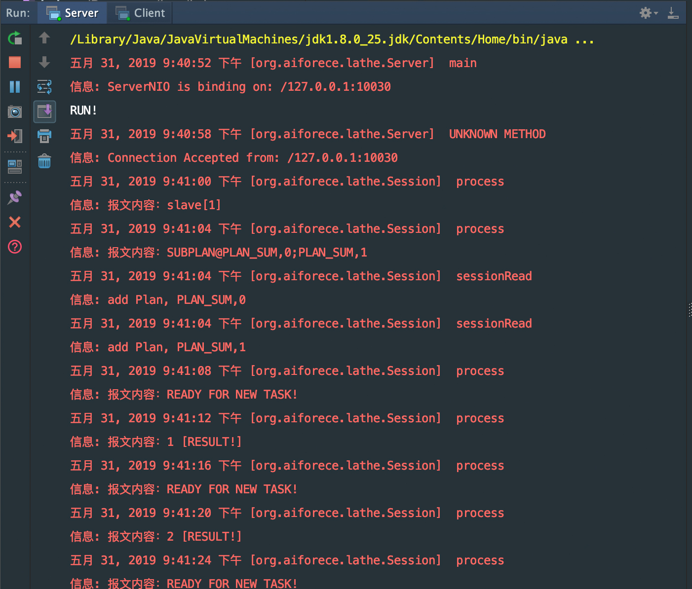
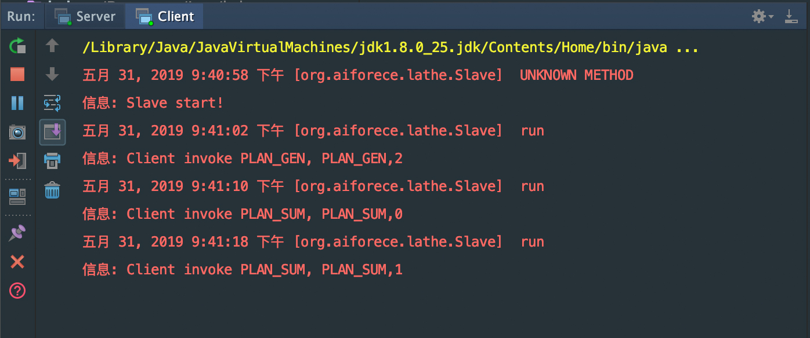

### LATHE
*** 
一个Master-Slave 模式的原型


### 执行内容

1. Master （实现是类Server)启动后，预先设置了一个待分解的任务
```java
ServerConfig serverConfig = new ServerConfig();
Server server = new Server(serverConfig);
server.plans.add(new Plan("2", Plan.PLAN_GEN));
server.start();
```
> PlAN_GEN 表示创建一个求从 0 到 X - 1 的整数，子任务是分别 对 Xi 加 1
> 
> 例如创建 PLAN_GEN,2 即要分解为 PLAN_SUM,0  PLAN_SUM,1 两个子任务
> 
> PLAN_SUM, i 即 对 i + 1 求和后返回作为结果
 

### 运行截图
1. 启动 Server




2. 启动 Client



